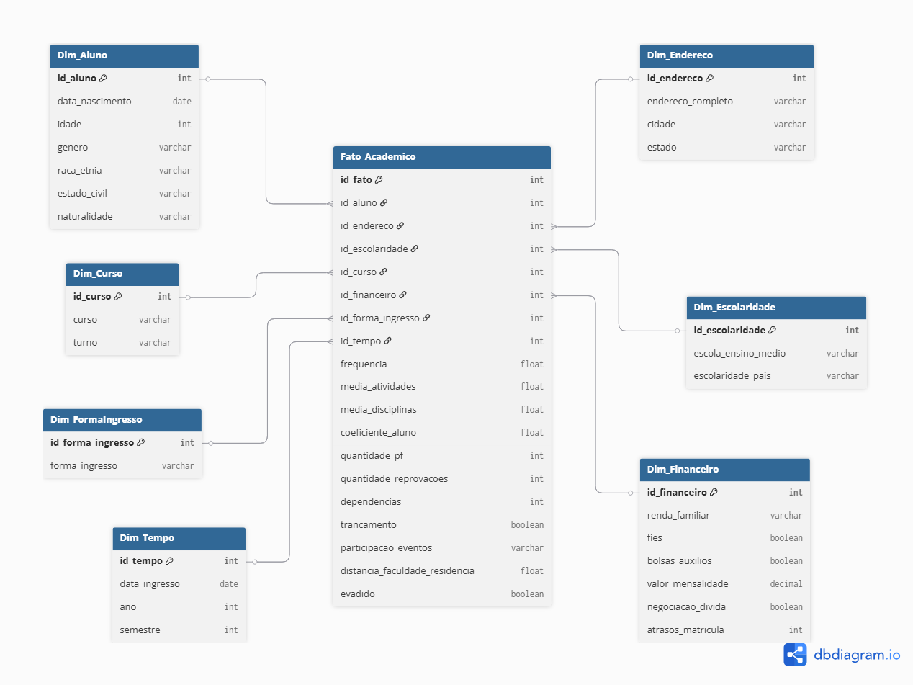

# InsightBI – Pipeline ETL para Análise de Evasão Universitária  

[](https://www.python.org/) 
[](https://airflow.apache.org/) 
[](https://www.postgresql.org/) 
[](https://www.docker.com/) 
[](https://docs.pytest.org/) 
[](LICENSE)

O **InsightBI** é um projeto de **engenharia de dados** voltado para a **análise e predição de evasão acadêmica** em universidades.  
O pipeline realiza o processo completo de **ETL (Extract, Transform, Load)**, incluindo **enriquecimento de dados via API do Google Maps**, e armazena os resultados em um banco **PostgreSQL**, orquestrado por **Apache Airflow**.

Os dados previamente foram criados pelo Faker, simulando registros reais de alunos, considerando fatores demográficos, socioeconômicos e acadêmicos, permitindo identificar padrões e possíveis causas da evasão estudantil.

Além do pipeline, o projeto conta com **testes unitários e de benchmark**, garantindo robustez, desempenho e reprodutibilidade dos dados.

---

## Arquitetura do projeto


---

## Funcionalidades Principais

- Pipeline **ETL completo** (extração, transformação, enriquecimento e carga)  
- Integração com a **Google Maps API** no enriquecimento para cálculo da distância entre residência e faculdade do aluno
- Armazenamento em **PostgreSQL**  
- Orquestração com **Apache Airflow** (DAG de ETL automatizada)
- Testes unitários e de benchmark com **Pytest** 
- Visualizações analíticas em **Jupyter Notebooks** com **Matplotlib** e **Seaborn**  

---

## Estrutura do Projeto  

```bash
InsightBI/
│
├── dags/                        # Pipelines orquestradas pelo Airflow
│   └── etl_faculdade_dag.py
├── data/                        # Dados Brutos em CSV e processados no ETL em PARQUET
│   ├── raw/
│   │   └── dados alunos.csv
│   ├── tmp/
│   │   ├── extracted.parquet
│   │   ├── transformed.parquet
│   │   └── enriched.parquet
├── docs/                       # Documentos do projeto
│   ├── dicionario de dados.xlsx
│   └── ModelagemDW.png
├── logs/                       # Logs do Airflow, do Logger e do Benchmark
├── notebooks/                  # Exploração e análise de dados
│   ├── analise_evasão.ipynb/
│   ├── explorar_transformacoes.ipynb/
│   ├── validar_enriquecimento.ipynb/
│   └── visualizar_raw.ipynb
├── plugins/                    # Plugins do Airflow
├── src/
│   ├── etl/                    # Código fonte do ETL (com enrichment)
│   │   ├── extract.py
│   │   ├── transform.py
│   │   ├── enrichment.py       # Enriquece os dados tratados com a API do Google para o calculo de distância
│   │   ├── load.py             # Carga para o Postgres
│   │   └── __init__.py
│   ├── utils/
│   │   ├── logger.py           # Função getLogger()
│   │   ├── googleapi.py        # Função da API do google
│   │   └── __init__.py
│   └── __init__.py
├── tests/								      # Testes Unitários e de Benchmark
│   ├── unit_tests/					    # Testes unitários do ETL
│   ├── benchmark/              # Teste de benchmark
│   ├── conftest.py
│   └── __init__.py
├── .env                        # Variáveis de ambientes
├── .gitignore
├── Dockerfile
├── docker-compose.yml
├── LICENSE
├── pytest.ini
├── requirements-dev.txt        # Dependências Python usadas fora do Docker
├── requirements.txt            # Dependências do docker
└── README.md

````

---

## Modelagem Dimensional

A estrutura analítica proposta segue o modelo **estrela (Star Schema)**, com uma tabela fato central (`Fato_Academico`) e dimensões auxiliares:



> Essa modelagem foi planejada para futura integração em um DataWarehouse

---

## Execução do Projeto

### Pré-Requisitos

- [Docker](https://www.docker.com/)

### 1. Clone o repositório

```bash
git clone https://github.com/jgabrielpl/InsightBI_PEI.git
cd InsightBI_PEI
```

### 2. Configuração Inicial

**Primeiramente faça a configuração do `.env` contendo as variáveis:**
```bash
GOOGLE_API_KEY = " "
ENDERECO_FACULDADE = " "

POSTGRES_USER=
POSTGRES_PASSWORD= 
POSTGRES_DB= 
POSTGRES_PORT=
POSTGRES_HOST= 

AIRFLOW_USER= 
AIRFLOW_PASSWORD=
``` 

### 3. Suba o ambiente Docker (Airflow + PostgreSQL)

```bash
docker compose up --build
```

### 4. Acesse o Airflow

* URL: [http://localhost:8080](http://localhost:8080)
* Usuário: `(Definido no .env)`
* Senha: `(Definido no .env)`

### 5. Execute o pipeline ETL no Airflow

Ative a DAG **`etl_faculdade_dag`** e acompanhe as etapas:

> Extract → Transform → Enrichment → Load

### 6. Executar Testes unitários

Executar:

```bash
pytest -v
```

Todos os módulos são cobertos:

* `extract`: leitura e validação de CSVs
* `transform`: normalização e cálculo de idade
* `enrichment`: mock de API do Google
* `load`: conexão e inserção no banco

### 7. Executar Teste Benchmark do Pipeline

```bash
pytest tests/benchmark/test_benchmark.py
```

Exemplo de resultado no log:
```bash

[2025-10-28 20:00:00]

extract     : 0.0017s
transform   : 0.0060s
enrichment  : 0.0017s
load        : 0.0083s
Total       : 0.0176s
```
---

## Tecnologias Utilizadas

- **Linguagem:** Python 3.11+
- **Orquestração:** Apache Airflow
- **Banco de Dados:** PostgreSQL
- **ETL:** Pandas, Numpy, SQLAlchemy e psycopg2
- **Infraestrutura:** Docker
- **Testes & Benchmark:** Pytest
- **Enriquecimento:** Google Maps API + Requests
- **Exploração e Visualização:** Jupyter Notebooks - Pandas, Matplotlib e Seaborn
- **Logging:** Python Logging

---

## Documentação

* [Dicionário de Dados](docs/dicionario%20de%20dados.xlsx)
* [Modelagem Dimensional](docs/ModelagemDW.png)

---

## Futuros Próximos Passos

* [ ] Criar camada de **Data Warehouse (DW)** via **dbt**
* [ ] Integrar **Soda ou Great Expectations** para validação de qualidade dos dados
* [ ] Monitoramento com **Prometheus + Grafana**

---

## Autor

**José Gabriel Pereira**
Estudante de Engenharia de Software | Foco em Engenharia de Dados

[LinkedIn](https://www.linkedin.com/in/jsgabrielpereira) · [GitHub](https://github.com/jgabrielpl)

---


